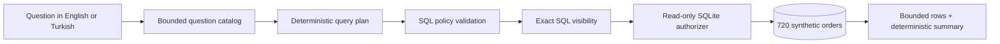

# Talk to Your Data — Safe Public Demo

**Ask a business question, inspect the exact SQL, and run it against 100% synthetic data. No account, API key, database, or external service required.**

[](https://github.com/emrekaany/talk-to-your-data-demo/actions/workflows/ci.yml)
[](https://github.com/emrekaany/talk-to-your-data-demo/actions/workflows/codeql.yml)
[](https://www.python.org/)
[](LICENSE)

> This is an independent public demonstration built from scratch around synthetic data. It contains no code, metadata, credentials, prompts, database identifiers, or client artefacts from the private product.

## Problem

Natural-language analytics demos often hide the most important questions:

- What SQL will actually run?
- Can the query write to the database?
- Which tables are reachable?
- Is the sample data safe to publish?
- Can a reviewer reproduce the result without an account?

This repository makes those boundaries visible. It provides a deliberately bounded question catalog, deterministic query plans, an exact-SQL preview, fail-closed validation, a second SQLite authorization layer, a hard row limit, a short execution budget and a local-only browser interface.

## Architecture



The public demo has no network path to a provider, model, customer system or real database. See [the detailed architecture](docs/architecture.md) and [security model](docs/security.md).

## Quickstart

Python 3.10 or newer is the only requirement.

```bash
git clone https://github.com/emrekaany/talk-to-your-data-demo.git
cd talk-to-your-data-demo
python -m pip install -e .
talk-data-demo demo
```

Start the zero-dependency local web interface:

```bash
talk-data-demo serve
```

Then open `http://127.0.0.1:8765`. The server rejects public binds such as `0.0.0.0`.

Ask a specific supported question:

```bash
talk-data-demo ask "Compare refund rate by region" --json
talk-data-demo questions
```

## Supported questions

- Show monthly revenue by region
- Show the top 5 products by revenue
- Compare refund rate by region
- Show orders and revenue for the last 30 days
- Compare average order value by channel

Turkish equivalents are supported as well. Unsupported questions fail with safe examples instead of generating speculative SQL.

## Measured evidence

The repository's claims are checked without network access:

- deterministic fixture: **720 orders**, **12 products**, fixed seed `20260814`;
- fixed reporting window: `2026-02-02` through `2026-07-31`;
- maximum result size: **200 rows** enforced by policy;
- default execution budget: **500 ms** with SQLite interruption;
- **21 passing tests** cover the CLI, Turkish/English catalog, policy, read-only authorizer, deterministic results, HTTP API, origin checks and loopback-only bind;
- the sdist and wheel build successfully, and the installed wheel passes `pip check` plus the CLI demo.

Run the same gate locally:

```bash
python -m unittest discover -s tests -v
python -m compileall -q src tests
python -m talk_to_your_data_demo demo --json
```

CI also installs the built wheel in a clean environment and runs the CLI smoke test.

## Safety contract

- Synthetic data only; every name and transaction is generated for this demo.
- No `.env` file, token, LLM endpoint, telemetry or outbound HTTP request.
- No arbitrary SQL input; questions map to reviewed templates.
- Only `SELECT`/CTE queries, allowlisted tables and one `LIMIT` of at most 200.
- SQLite `query_only` plus an authorizer that denies write/schema operations.
- Local web server binds only to loopback and rejects cross-origin writes.
- DOM output uses text nodes rather than injecting response HTML.

## Limitations

This repository proves an offline safety and interaction pattern; it is not the private production product.

- The question catalog is intentionally small and deterministic, not a general LLM.
- SQLite and synthetic retail data do not represent Oracle, warehouse or lakehouse behavior.
- There is no authentication because the server is loopback-only and holds no private data.
- There are no private metadata connectors, vector search, feedback learning or enterprise deployment modules.
- Test evidence is not a benchmark of accuracy on arbitrary schemas or questions.

## Free demo → production engagement

Use this repository freely to evaluate the interaction and safety model. If you need governed natural-language analytics for a real organization—private metadata connectors, role-aware SQL policy, evaluation, observability, deployment or Talend integration—open a [GitHub issue](https://github.com/emrekaany/talk-to-your-data-demo/issues) with a **sanitized problem statement only**.

Never post credentials, connection strings, schema exports, customer files or internal screenshots in an issue.

## Project documents

- [Architecture](docs/architecture.md)
- [Security model](docs/security.md)
- [Provenance](PROVENANCE.md)
- [Contributing](CONTRIBUTING.md)
- [Security reporting](SECURITY.md)
- [Changelog](CHANGELOG.md)

## License

Apache License 2.0. See [LICENSE](LICENSE).
